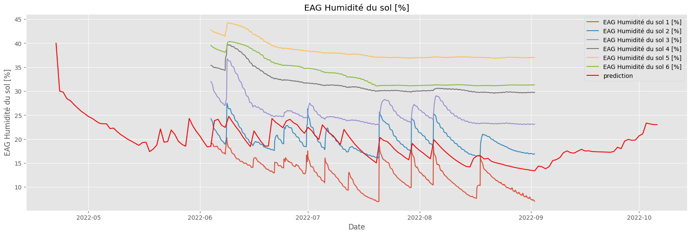

# S8IA - Assimilation de Données Agricoles

Projet d'IA de CentraleSupélec du S8 pour <i>Osiris Agriculture</i> sur l'assimilation de données agricoles dans le but de spécifier un modèle de croissance de cultures. Le but final de notre client est de pouvoir prédire efficacement la croissance des cultures pour prévoir les besoins en irrigation de façon précise et réduire la consommation d'eau des agriculteurs.

## Installation
Pour installer le projet, clonez le repository git et installez les dépendances :
```bash
git clone CS_POLEIA_S8_04_OSIRIS
py -m pip install -r .\requirements.txt
```
Cela vous permettra de faire fonctionner l'ensemble de nos scripts sur vos machines.

## Objectif

L'objectif de ce dossier est de présenter un ensemble de méthodes d'assimilations de données, écrites en language `python` et en code orienté objet. Ces méthodes ont pour but d'ajuster le modèle de croissance WOFOST aux données de notre client.

Les méthodes présentées sont:
- <b>EnKF</b>: ensemble de filtres de Kalman
- <b>4dVar</b>: méthode variationelle 4d
- <b>PF</b>: filtre à particules
- <b>EnKF-LSTM</b>: méthode LSTM basé sur un EnKF

Ces méthodes sont détaillées dans le rapport complémentaire à ce projet.
Afin de mener à bien cet objectif d'utilisation des données clients, il est également important de développer une façon de récupérer des informations sur les zones du champ sans capteur. Nous avons donc travailler sur l'implémentation spatiale du modèle en ce sens. Vous trouverez:
- <b> Spatial.py</b>, un fichier contenant des techniques pour interpoler et extrapoler les données de nos clients. 

## Structure

Le répositoire Git est structuré en 2 parties. Un dossier `SOURCES` contient les fichiers `py` avec les classes de chaque méthode ainsi que des classes utilitaires. C'est là que se trouve le gros du code qui permet de faire tourner les modèles.

Un autre dossier `DEMO` contient l'ensemble des `Jupyter` utile à l'exécution du projet. On y trouver des fichiers nommé `<méthode>_demo.ipynb` qui correspondent au démonstration de chaque méthode, adaptées au données du client et permettent de mesurer efficacement les performances de chaque technique d'assimilation pour réajuster le modèle au mesures. Ce sont là les résultats pratiques de notre projet.

Le dossier `DEMO`contient également un sous-dossier `data` contenant l'ensemble des paramètres et données utilisées par le modèle. Il y en a de deux types: celles fournies par le client, qui relève donc de mesures expérimentales dans des champs d'agriculteurs, et celles intrinsèques à WOFOST, le modèle de simulation des cultures utilisé dans l'ensemble du projet, et qui permettent donc le fonctionnement des simulations.

## WOFOST

Revenons brièvement sur WOFOST: c'est le noyau sur lequel repose les simulations de ce projet. Le module WOFOST permet de simuler la croissance de plantes, en fonction de différents paramètres. L'objectf du projet est de réussir à simuler cette même croissance, pour des plantes non encore dans la base de données de WOFOST au travers de l'assimilation de donnée. Ci-dessous, un graphique superposant la courbe d'humidité du sol de la simulation WOFOST et celle des observations. Notre objectif sera de réduire au maximum l'écart entre les deux courbes.



La courbe rouge correspond à la prédiction d'un modèle WOFOST réglé grossièrement sur des paramètres proches de ceux du champ.

## Données

Les données que nous a fourni le client proviennent des champs d'agriculteurs. On y retrouve 3 catégories, avec 6 Sondes <i>Canon</i>, 2 Sondes <i>Rampe</i> et 3 Sondes <i>Robot</i> qui ont toutes trois récupéré différentes informations sur la précipitation, l'humidité du sol et la température à différentes températures en des endroits bien précis du champ.

Ces  données sont contenues dans le dossier `DEMO\data` à côté des Jupyter permettant l'assimilation de ces données.


## Principaux Résultats

L'objectif de ce projet était d'évaluer la pertinence des méthodes d'assimilation de données en vue de les intégrer à un robot dans un champ, capable d'arroser de manière intelligente les plants de culture d'agriculteurs. Les 4 méthodes présentent chacune des avantages et inconvénients.


| Méthodes 	| Avantages                                                            	| Inconvénients                                                                                                    	|
|----------	|----------------------------------------------------------------------	|------------------------------------------------------------------------------------------------------------------	|
| ENKF     	| - Facile à implémenter<br>- Exécution rapide<br>- Précision correcte 	| - Sensible aux erreurs d'observations<br>- Correction discontinue<br>- Impossibilité de récupérer des paramètres 	|
| PF       	| - Rapide<br>- Précis<br>- Permet d'obtenir les paramètres du modèle  	| - Nécessite des observations de qualité<br>- Précision correcte mais encore faible                               	|
| 4DVAR    	| - Permet d'obtenir les paramètres du modèle<br>- Précision correcte  	| - Méthode assez lente (temps de calcul important)<br>- Précision relativement faible                             	|
| LSTM     	| - Meilleure précision obtenue                                        	| - Très très lente <br> - Réglé pour des observations en particulier. Non généralisable.                              	|

Au vu de ces réponses, il semble aventageux de choisir plutôt une méthode comme le <b>filtre à particule</b> ou le <b>filtre de Kalman</b> pour assimiler les données. Ces deux techniques offrent des avantages différents pour une précision assez proche. Au final, la technique du filtre particulaire à l'avantage de permettre de récupérer des paramètres optimaux, chose impossible pour le filtre de Kalman. 


## Remerciements

Ce projet a été réalisé par Erwin Deng, Yi Zhong, Noé Bertramo, MingYang Sun et Loïc Jaillet. 

Il n'aurait pas pu être fini sans l'aide de nos professeurs, Jean-Philippe Poli et Wassila Ouerdane, ni celui de nos interlocuteurs chez Osiris Agriculture, Alexis Carlier et Henri Desesquelles.

